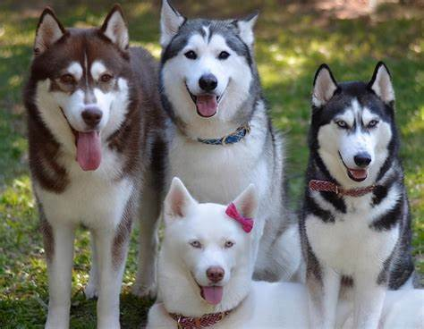

{: .right }

Huskies bred in cities are usually out of the wild, docile and very emotional, and are bred to be loyal companions and good working hunting dogs. Keeping them may be good for our mental health and well-being.

### Meek and Friendly

Meek and friendly, can quickly get acquainted with the owner, almost never appear to actively attack the phenomenon of human beings, can be friendly with people, take it out for a walk can also be friendly with other partners, will not fight.

Besides, they are easy to get along with, won't be possessive of the owner and can be friendly with other small animals.

The sociable and friendly nature of Huskies encourages owners to interact with others and animals, which can help reduce feelings of loneliness, improve social skills, and alleviate social anxiety.

### Active

Lively and active, always full of passion and enthusiasm.

The energetic and enthusiastic nature of Huskies can inspire positive emotions in their owners, combat depressive feelings, and add joy and excitement to life.

### Quiet

Rarely bark, although active, but will not bark, live in the city, flat without worrying about neighbour complaints.

As quiet companions, Huskies do not often bark, reducing noise-related stress and providing a peaceful home environment that aids in relaxation and stress reduction.

### Neurotic

The neurotic charactor makes Huskies easy to make people laugh. Just look at their "silly" behaviours and eyes full of "wisdom", you can easy to decrease your pressure and turn out to be happy!

> Neurotic, destructive, rambunctious, diarrhoea, hyperactive, very fraternal, moulting period, difficult to train and other disadvantages.
{: .prompt-warning }
